---


---
# **介绍**
这是上海叠腾网络科技有限公司的面试题。

笔试说明： 
    数据表第一行是列名，列0代表y，列1-6代表x1-x6；
    请对数据进行分析，给出分析过程和结论，并进行建模和模型评价，在建模过程中考虑降维的可能性并给出理由。

本人通过观察分析数据，最终建立多重线性回归模型，并发现数据存在多重共线性等问题，需要降维。
以下为本人对数据的分析的过程。

<p style="font-family: times, serif; font-size:18pt; font-style:italic">
本人保证，此笔试题由杨文斌独立完成，部分内容参考互联网，没有任何作弊行为，如有不实，本人愿意负法律责任。
</p>
<div style="text-align: right"> **杨文斌** </div>


# **读取数据** {.tabset .tabset-fade .tabset-pills}
## 载入数据/包

```r
data <- read.csv('~/Desktop/test_1.csv',stringsAsFactors=FALSE)
library(ggplot2)
library(car)
library(corrplot)
```

## 重命名列标题

```r
colnames(data)[1] <- 'y'
names(data)[c(2:7)]<- c('x1','x2','x3','x4','x5','x6')
```
# **分析数据**
## 总览数据

```r
summary(data)
```

```
##        y                x1               x2               x3               x4               x5        
##  Min.   :0.0000   Min.   :0.0000   Min.   :0.0000   Min.   :0.0000   Min.   :0.0000   Min.   :0.0000  
##  1st Qu.:0.8063   1st Qu.:0.1565   1st Qu.:0.3818   1st Qu.:0.5830   1st Qu.:0.5981   1st Qu.:0.6818  
##  Median :0.8662   Median :0.1826   Median :0.4364   Median :0.6302   Median :0.6729   Median :0.7727  
##  Mean   :0.8566   Mean   :0.1826   Mean   :0.4204   Mean   :0.6308   Mean   :0.6671   Mean   :0.7649  
##  3rd Qu.:0.9085   3rd Qu.:0.2000   3rd Qu.:0.4727   3rd Qu.:0.6751   3rd Qu.:0.7383   3rd Qu.:0.8523  
##  Max.   :1.0000   Max.   :1.0000   Max.   :1.0000   Max.   :1.0000   Max.   :1.0000   Max.   :1.0000  
##        x6           
##  Min.   :0.0000073  
##  1st Qu.:0.2621112  
##  Median :0.5070673  
##  Mean   :0.5059543  
##  3rd Qu.:0.7525149  
##  Max.   :0.9999652
```

```r
str(data)
```

```
## 'data.frame':	8270 obs. of  7 variables:
##  $ y : num  0.00352 0.02113 0.12676 0.45423 0.72887 ...
##  $ x1: num  0.678 0.713 0.73 0.687 0.548 ...
##  $ x2: num  0.364 0.418 0.436 0.455 0.455 ...
##  $ x3: num  0.604 0.619 0.51 0.598 0.555 ...
##  $ x4: num  0.224 0.234 0.271 0.43 0.692 ...
##  $ x5: num  0.477 0.636 0.716 0.75 0.773 ...
##  $ x6: num  0.0662 0.5575 0.9576 0.2588 0.8886 ...
```

```r
dim(data)
```

```
## [1] 8270    7
```

```r
# 去掉方差为0 的行，这些本身没有意义，也妨碍后续运算
data <- data[apply(data, 1, var)!=0,]
```

## 简易图，找规律

```r
#散点图
par(mfrow = c(3,2))
ggplot(data, aes(x1, y)) +geom_point()
```

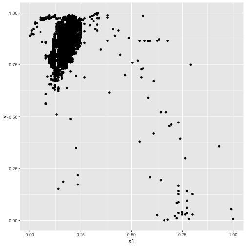

```r
ggplot(data, aes(x2, y)) +geom_point()
```

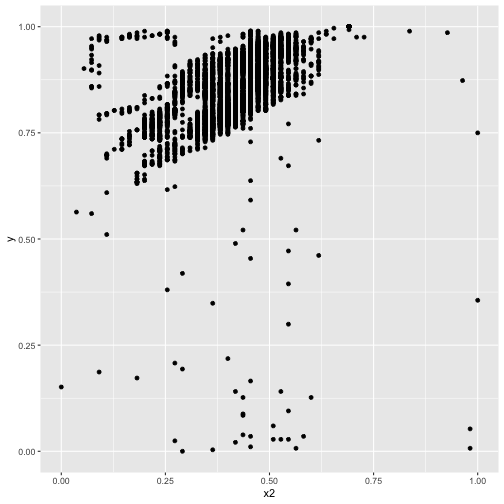

```r
ggplot(data, aes(x3, y)) +geom_point()
```

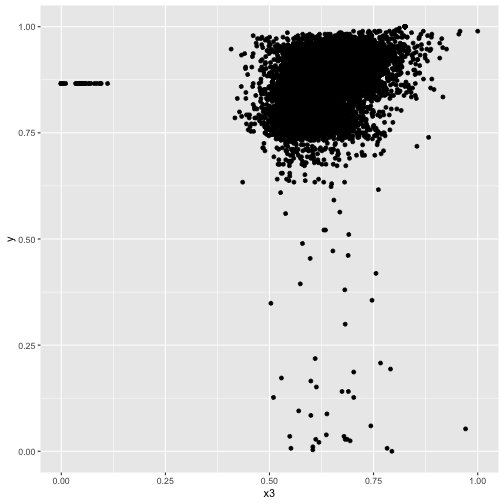

```r
ggplot(data, aes(x4, y)) +geom_point()
```

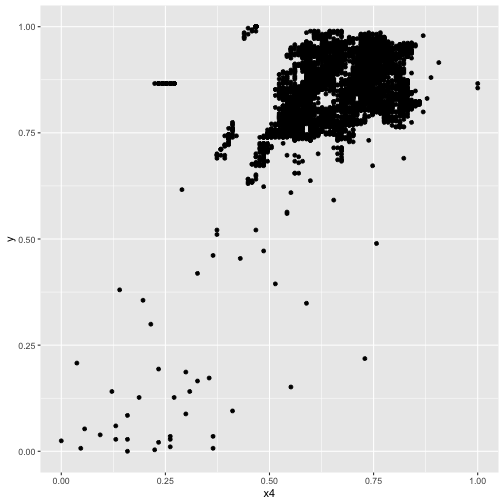

```r
ggplot(data, aes(x5, y)) +geom_point()
```

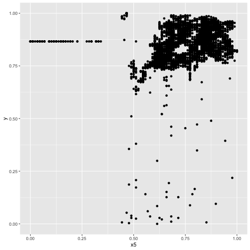

```r
ggplot(data, aes(x6, y)) +geom_point()
```

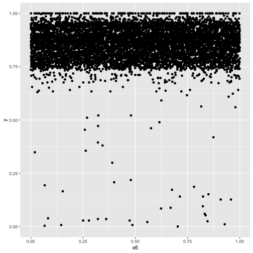


```r
#密度图
par(mfrow = c(3,2))
ggplot(data, aes(x= x1, fill = y)) +geom_density(alpha = 0.3)
```

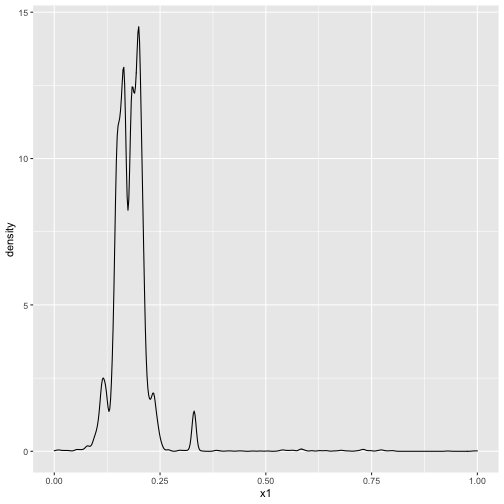

```r
ggplot(data, aes(x= x2, fill = y)) +geom_density(alpha = 0.3)
```

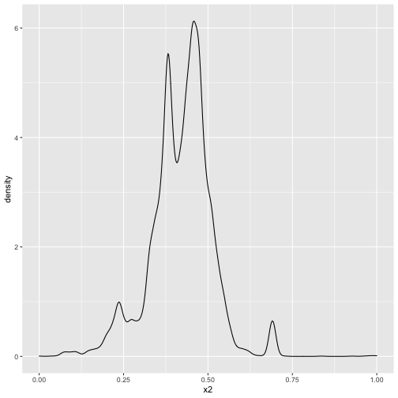

```r
ggplot(data, aes(x= x3, fill = y)) +geom_density(alpha = 0.3)
```

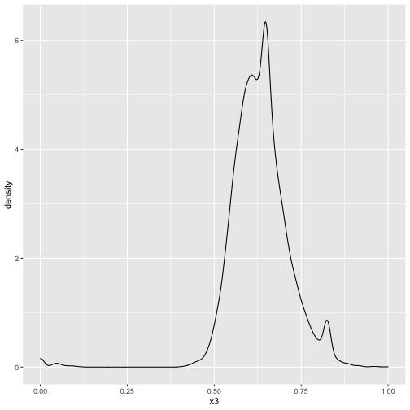

```r
ggplot(data, aes(x= x4, fill = y)) +geom_density(alpha = 0.3)
```

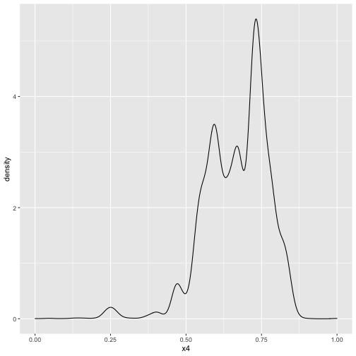

```r
ggplot(data, aes(x= x5, fill = y)) +geom_density(alpha = 0.3)
```

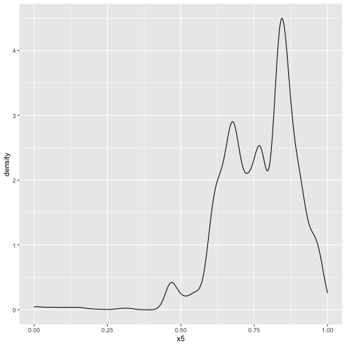

```r
ggplot(data, aes(x= x6, fill = y)) +geom_density(alpha = 0.3)
```

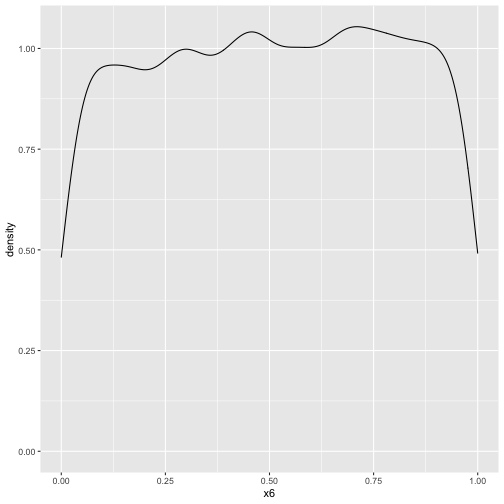


```r
#箱形图
par(mfrow = c(3,2))
ggplot(data, aes(x1, y)) +  geom_boxplot(notch = TRUE) + 
  scale_fill_brewer(palette = "Pastel2")
```

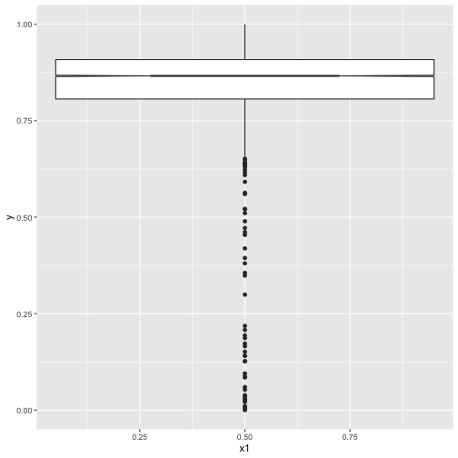


```r
# 拟合回归线段以及95置信域的散点图
par(mfrow = c(3,2))
ggplot(data, aes(x1, y)) +geom_point() +
  scale_colour_brewer(palette = "Set1") +geom_smooth()
```

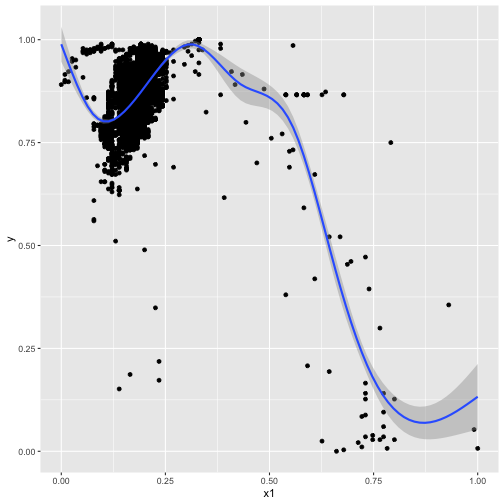

```r
ggplot(data, aes(x2, y)) +geom_point() +
  scale_colour_brewer(palette = "Set1") +geom_smooth()
```

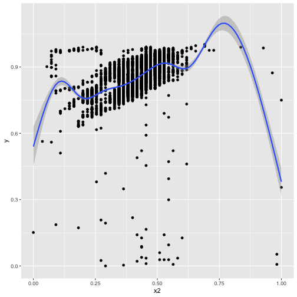

```r
ggplot(data, aes(x3, y)) +geom_point() +
  scale_colour_brewer(palette = "Set1") +geom_smooth()
```

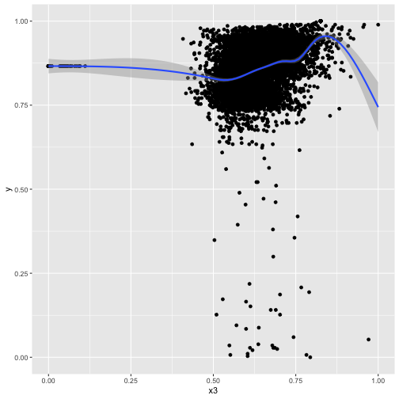

```r
ggplot(data, aes(x4, y)) +geom_point() +
  scale_colour_brewer(palette = "Set1") +geom_smooth()
```

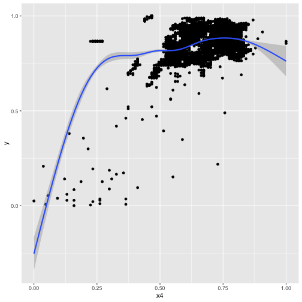

```r
ggplot(data, aes(x5, y)) +geom_point() +
  scale_colour_brewer(palette = "Set1") +geom_smooth()
```

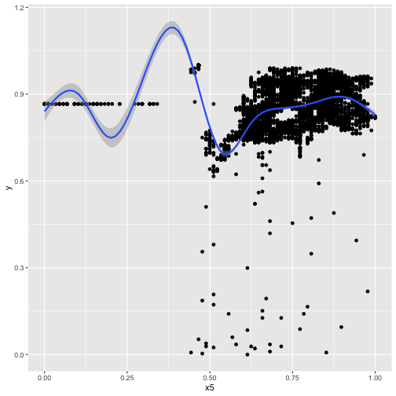

```r
ggplot(data, aes(x6, y)) +geom_point() +
  scale_colour_brewer(palette = "Set1") +geom_smooth()
```

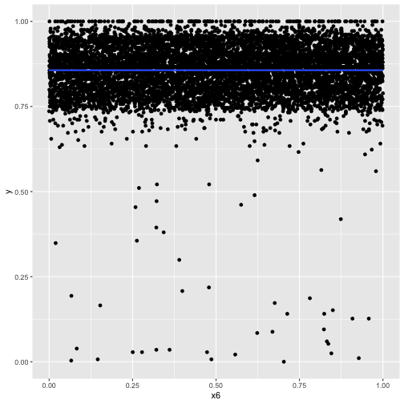

```r
#查看相关性
data_cor <- cor(data)
scatterplotMatrix(data) 
```

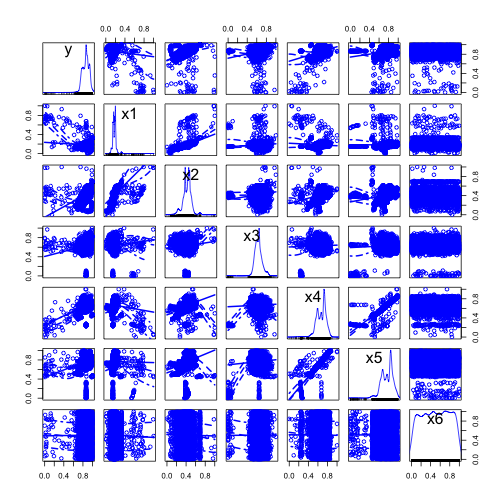
由以上图形可知，y与x的相关性不强,需进行量化比较

## 量化比较

```r
corrplot(corr = data_cor, method = 'color', 
         addCoef.col="grey") 
```

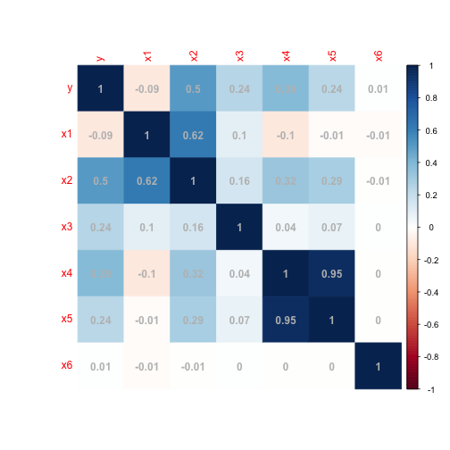

```r
library(psych)
pairs.panels(data) 
```

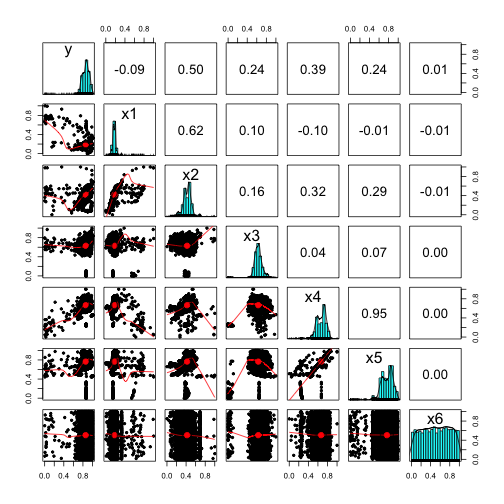
## 结论1:数据相关性分析
可以明显看出y和x1,x6呈负相关关系，系数分别为-0.09及-0.01，
y和x2呈中度正相关关系，与x4低度相关,
与其他不相关或相关性很弱以至于没有实际价值

# **建模——K-means模型**

## 筛选数据

```r
data_x <- data[,2:7]
```

## 定义kmeans函数

```r
customKmeans<-function(dataset=NA,k=NA){
  if(is.na(dataset) || is.na(k)){
    stop("You must input valid parameters!!")
  }
  #计算两点之间欧式距离的函数
  Eudist<-function(x,y){
    distance<-sqrt(sum((x-y)^2))
    return (distance)
  }
  rows.dataset<-nrow(dataset)
  continue.change=TRUE
  initPoint<-dataset[sample.int(rows.dataset,size = k),]
  formerPoint<-initPoint
  iterPoint<-matrix(0,nrow = k,ncol = ncol(dataset))
  #记录每一个点到每一个类的距离
  error.matrix<-matrix(0,nrow=rows.dataset,ncol=k)
  while(continue.change){
    #记录每个点所属的类是哪一个
    cluster.matrix<-matrix(0,nrow=rows.dataset,ncol=k)
    for(i in 1:rows.dataset){
      #计算每个点到三个初始中心点的距离
      for(j in 1:k){
        error.matrix[i,j]<-Eudist(dataset[i,],formerPoint[j,])
      }
    }
    #将每一个点所属的类计算出来
    for(i in 1:rows.dataset){
      cluster.matrix[i,which.min(error.matrix[i,])]<-1
    }
    #更新新的质心位置
    for(i in 1:k){
      iterPoint[i,]<-apply(dataset[which(cluster.matrix[,i] == 1),]
                           ,2,"mean")
    }
    all.true<-c()
    #判断中心点是否已经保持不变
    for(i in 1:k){
      if(all(formerPoint[i,] == iterPoint[i,]) == T){
        all.true[i]<-TRUE
      }
    }
    formerPoint = iterPoint
    continue.change=ifelse(all(all.true) == T,F,T)
  }
  colnames(iterPoint)<-colnames(dataset)
  out=list()
  out[["centers"]]<-iterPoint
  out[["distance"]]<-error.matrix
  out[["cluster"]]<-rep(1,rows.dataset)
  for(i in 1:rows.dataset){
    out[["cluster"]][i]<-which(cluster.matrix[i,] == 1)
  }
  #返回结果，包括中心点坐标，
  #每个点离每一个中心点的位置以及每个数据点所属的聚类名称
  return(out)
}
```

## 数据标准化

```r
min.max.norm <- function(x){
  ((x-min(x))/(max(x)-min(x)))
}

data_x <- apply(data_x,2,min.max.norm)
```

## k取2到8，评估K

```r
library(fpc) 
K <- 2:8
round <- 10 # 每次迭代10次，避免局部最优
rst <- sapply(K, function(i){
  print(paste("K=",i))
  mean(sapply(1:round,function(r){
    print(paste("Round",r))
    result <- customKmeans(data_x, i)
    stats <- cluster.stats(dist(data_x), result$cluster)
    stats$avg.silwidth
  }))
})
```

```
## [1] "K= 2"
## [1] "Round 1"
## [1] "Round 2"
## [1] "Round 3"
## [1] "Round 4"
## [1] "Round 5"
## [1] "Round 6"
## [1] "Round 7"
## [1] "Round 8"
## [1] "Round 9"
## [1] "Round 10"
## [1] "K= 3"
## [1] "Round 1"
## [1] "Round 2"
## [1] "Round 3"
## [1] "Round 4"
## [1] "Round 5"
## [1] "Round 6"
## [1] "Round 7"
## [1] "Round 8"
## [1] "Round 9"
## [1] "Round 10"
## [1] "K= 4"
## [1] "Round 1"
## [1] "Round 2"
## [1] "Round 3"
## [1] "Round 4"
## [1] "Round 5"
## [1] "Round 6"
## [1] "Round 7"
## [1] "Round 8"
## [1] "Round 9"
## [1] "Round 10"
## [1] "K= 5"
## [1] "Round 1"
## [1] "Round 2"
## [1] "Round 3"
## [1] "Round 4"
## [1] "Round 5"
## [1] "Round 6"
## [1] "Round 7"
## [1] "Round 8"
## [1] "Round 9"
## [1] "Round 10"
## [1] "K= 6"
## [1] "Round 1"
## [1] "Round 2"
## [1] "Round 3"
## [1] "Round 4"
## [1] "Round 5"
## [1] "Round 6"
## [1] "Round 7"
## [1] "Round 8"
## [1] "Round 9"
## [1] "Round 10"
## [1] "K= 7"
## [1] "Round 1"
## [1] "Round 2"
## [1] "Round 3"
## [1] "Round 4"
## [1] "Round 5"
## [1] "Round 6"
## [1] "Round 7"
## [1] "Round 8"
## [1] "Round 9"
## [1] "Round 10"
## [1] "K= 8"
## [1] "Round 1"
## [1] "Round 2"
## [1] "Round 3"
## [1] "Round 4"
## [1] "Round 5"
## [1] "Round 6"
## [1] "Round 7"
## [1] "Round 8"
## [1] "Round 9"
## [1] "Round 10"
```

## K值轮廓系数图

```r
#可以看到如下的示意图
plot(K,rst,type='l',main='K', ylab='轮廓系数')   
```

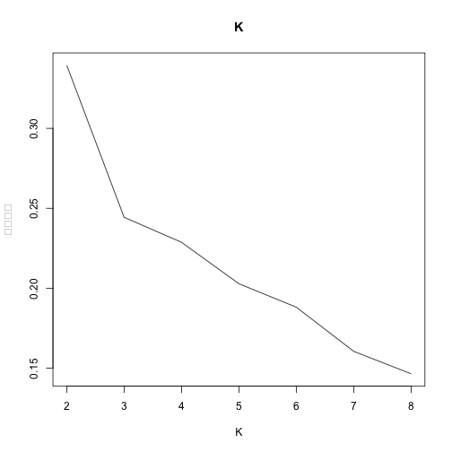

```r
#轮廓系数越大越好，所以轮廓为2
```

## 聚类结果可视化

```r
par(mfrow = c(3,2))
result <- customKmeans(data_x,k=2)
plot(data$x1,data$y,col=result$cluster,
     main="kmeansClustering_x1",pch=19)
plot(data$x2,data$y,col=result$cluster,
     main="kmeansClustering_x2",pch=19)
plot(data$x3,data$y,col=result$cluster,
     main="kmeansClustering_x3",pch=19)
plot(data$x4,data$y,col=result$cluster,
     main="kmeansClustering_x4",pch=19)
plot(data$x5,data$y,col=result$cluster,
     main="kmeansClustering_x5",pch=19)
plot(data$x6,data$y,col=result$cluster,
     main="kmeansClustering_x6",pch=19)
```

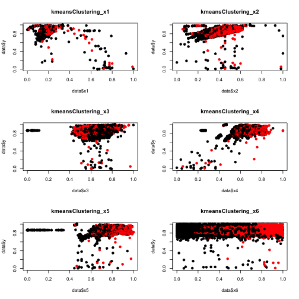

```r
#由图像可知，y和x1~x5都有高度相似性，和x6差异性比较高，
#但是规律并不明显
```


```r
result_output <- data.frame(data[,2:7],result$cluster)
Data1 <- data[,2:7][which(result_output$result.cluster==1),]
Data2 <- data[,2:7][which(result_output$result.cluster==2),]
par(mfrow = c(2,2))
plot(density(Data1[,1]),col="red",main="R")
plot(density(Data1[,2]),col="red",main="M")
plot(density(Data2[,1]),col="red",main="R")
plot(density(Data2[,2]),col="red",main="M")
```

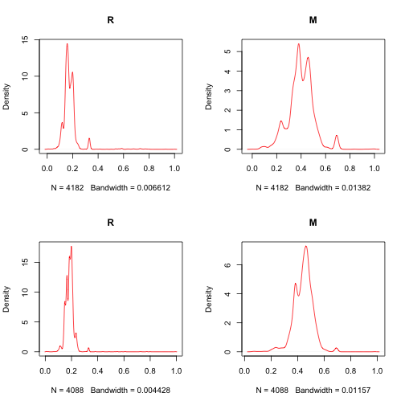
# **建模——多元线性回归模型**

## 简单建模

```r
data.lm <- lm(y ~., data)
data.lm
```

```
## 
## Call:
## lm(formula = y ~ ., data = data)
## 
## Coefficients:
## (Intercept)           x1           x2           x3           x4           x5           x6  
##    0.535682    -0.725166     0.673273     0.174831     0.618877    -0.462516     0.001792
```
## 模型解释

```r
#截距0.535682，x2~x4与y呈正相关;x1,x5与y呈负相关，
#x6对模型影响较小
summary(data.lm)
```

```
## 
## Call:
## lm(formula = y ~ ., data = data)
## 
## Residuals:
##      Min       1Q   Median       3Q      Max 
## -0.52302 -0.03755  0.00244  0.03112  0.77330 
## 
## Coefficients:
##              Estimate Std. Error t value Pr(>|t|)    
## (Intercept)  0.535682   0.006005  89.207   <2e-16 ***
## x1          -0.725166   0.015462 -46.900   <2e-16 ***
## x2           0.673273   0.009955  67.633   <2e-16 ***
## x3           0.174831   0.006610  26.450   <2e-16 ***
## x4           0.618877   0.019846  31.185   <2e-16 ***
## x5          -0.462516   0.014880 -31.084   <2e-16 ***
## x6           0.001792   0.002042   0.878     0.38    
## ---
## Signif. codes:  0 '***' 0.001 '**' 0.01 '*' 0.05 '.' 0.1 ' ' 1
## 
## Residual standard error: 0.05324 on 8263 degrees of freedom
## Multiple R-squared:  0.5888,	Adjusted R-squared:  0.5885 
## F-statistic:  1972 on 6 and 8263 DF,  p-value: < 2.2e-16
```

对于x1至x5来说，由于P<0.05，于是在α=0.05水平下，回归系数有统计学意义，y和x1至x5存在直线回归关系。
残差: 0.05324 
R方:  0.5888

## 分量剩余图

```r
library(car)
crPlots(data.lm)
```

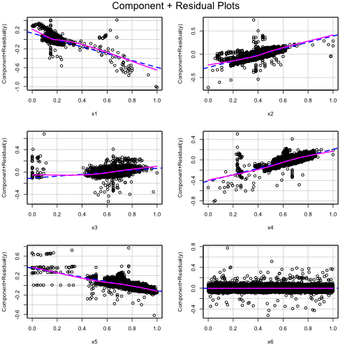
## 优化模型1

```r
data.lm2 <- step(data.lm)
```

```
## Start:  AIC=-48503.15
## y ~ x1 + x2 + x3 + x4 + x5 + x6
## 
##        Df Sum of Sq    RSS    AIC
## - x6    1    0.0022 23.426 -48504
## <none>              23.424 -48503
## - x3    1    1.9832 25.407 -47833
## - x5    1    2.7390 26.163 -47591
## - x4    1    2.7568 26.180 -47585
## - x1    1    6.2353 29.659 -46553
## - x2    1   12.9669 36.391 -44862
## 
## Step:  AIC=-48504.38
## y ~ x1 + x2 + x3 + x4 + x5
## 
##        Df Sum of Sq    RSS    AIC
## <none>              23.426 -48504
## - x3    1    1.9838 25.410 -47834
## - x5    1    2.7386 26.164 -47592
## - x4    1    2.7562 26.182 -47586
## - x1    1    6.2380 29.664 -46554
## - x2    1   12.9671 36.393 -44863
```

```r
summary(data.lm2)
```

```
## 
## Call:
## lm(formula = y ~ x1 + x2 + x3 + x4 + x5, data = data)
## 
## Residuals:
##      Min       1Q   Median       3Q      Max 
## -0.52306 -0.03748  0.00258  0.03115  0.77271 
## 
## Coefficients:
##              Estimate Std. Error t value Pr(>|t|)    
## (Intercept)  0.536616   0.005910   90.80   <2e-16 ***
## x1          -0.725292   0.015461  -46.91   <2e-16 ***
## x2           0.673278   0.009955   67.64   <2e-16 ***
## x3           0.174852   0.006610   26.45   <2e-16 ***
## x4           0.618803   0.019845   31.18   <2e-16 ***
## x5          -0.462477   0.014879  -31.08   <2e-16 ***
## ---
## Signif. codes:  0 '***' 0.001 '**' 0.01 '*' 0.05 '.' 0.1 ' ' 1
## 
## Residual standard error: 0.05324 on 8264 degrees of freedom
## Multiple R-squared:  0.5887,	Adjusted R-squared:  0.5885 
## F-statistic:  2366 on 5 and 8264 DF,  p-value: < 2.2e-16
```
## 优化模型2

```r
data.lm3<-update(data.lm2, .~. +x3*x4)
summary(data.lm3)
```

```
## 
## Call:
## lm(formula = y ~ x1 + x2 + x3 + x4 + x5 + x3:x4, data = data)
## 
## Residuals:
##      Min       1Q   Median       3Q      Max 
## -0.53293 -0.03419 -0.00051  0.03081  0.61111 
## 
## Coefficients:
##              Estimate Std. Error t value Pr(>|t|)    
## (Intercept)  0.827455   0.011075  74.716   <2e-16 ***
## x1          -0.748212   0.014681 -50.965   <2e-16 ***
## x2           0.669007   0.009441  70.863   <2e-16 ***
## x3          -0.324151   0.017547 -18.474   <2e-16 ***
## x4          -0.053200   0.029005  -1.834   0.0667 .  
## x5          -0.370559   0.014429 -25.682   <2e-16 ***
## x3:x4        0.968367   0.031805  30.447   <2e-16 ***
## ---
## Signif. codes:  0 '***' 0.001 '**' 0.01 '*' 0.05 '.' 0.1 ' ' 1
## 
## Residual standard error: 0.05049 on 8263 degrees of freedom
## Multiple R-squared:  0.6302,	Adjusted R-squared:   0.63 
## F-statistic:  2347 on 6 and 8263 DF,  p-value: < 2.2e-16
```
## 优化模型3

```r
data.lm4<-update(data.lm3, .~. +x1*x3)
summary(data.lm4)
```

```
## 
## Call:
## lm(formula = y ~ x1 + x2 + x3 + x4 + x5 + x3:x4 + x1:x3, data = data)
## 
## Residuals:
##      Min       1Q   Median       3Q      Max 
## -0.53126 -0.03308 -0.00068  0.03017  0.48930 
## 
## Coefficients:
##              Estimate Std. Error t value Pr(>|t|)    
## (Intercept)  0.577020   0.014426  39.999  < 2e-16 ***
## x1          -0.043537   0.030793  -1.414    0.157    
## x2           0.758592   0.009727  77.988  < 2e-16 ***
## x3           0.102522   0.023654   4.334 1.48e-05 ***
## x4           0.012473   0.028024   0.445    0.656    
## x5          -0.320164   0.014021 -22.835  < 2e-16 ***
## x3:x4        0.693465   0.032410  21.397  < 2e-16 ***
## x1:x3       -1.310483   0.050885 -25.754  < 2e-16 ***
## ---
## Signif. codes:  0 '***' 0.001 '**' 0.01 '*' 0.05 '.' 0.1 ' ' 1
## 
## Residual standard error: 0.04858 on 8262 degrees of freedom
## Multiple R-squared:  0.6577,	Adjusted R-squared:  0.6574 
## F-statistic:  2268 on 7 and 8262 DF,  p-value: < 2.2e-16
```
## 优化模型4

```r
data.lm5<-update(data.lm4, .~. +x2*x5)
summary(data.lm5)
```

```
## 
## Call:
## lm(formula = y ~ x1 + x2 + x3 + x4 + x5 + x3:x4 + x1:x3 + x2:x5, 
##     data = data)
## 
## Residuals:
##      Min       1Q   Median       3Q      Max 
## -0.54102 -0.03321 -0.00346  0.03109  0.49709 
## 
## Coefficients:
##             Estimate Std. Error t value Pr(>|t|)    
## (Intercept)  0.43703    0.01879  23.261   <2e-16 ***
## x1          -0.01170    0.03068  -0.381   0.7030    
## x2           1.12334    0.03315  33.887   <2e-16 ***
## x3           0.07296    0.02361   3.091   0.0020 ** 
## x4          -0.05215    0.02837  -1.838   0.0660 .  
## x5          -0.06061    0.02651  -2.286   0.0223 *  
## x3:x4        0.76175    0.03270  23.296   <2e-16 ***
## x1:x3       -1.39888    0.05107 -27.393   <2e-16 ***
## x2:x5       -0.53680    0.04667 -11.501   <2e-16 ***
## ---
## Signif. codes:  0 '***' 0.001 '**' 0.01 '*' 0.05 '.' 0.1 ' ' 1
## 
## Residual standard error: 0.0482 on 8261 degrees of freedom
## Multiple R-squared:  0.6631,	Adjusted R-squared:  0.6628 
## F-statistic:  2033 on 8 and 8261 DF,  p-value: < 2.2e-16
```
## 优化模型5

```r
data.lm6<-update(data.lm5, .~. -x5-x3)
summary(data.lm6)
```

```
## 
## Call:
## lm(formula = y ~ x1 + x2 + x4 + x3:x4 + x1:x3 + x2:x5, data = data)
## 
## Residuals:
##      Min       1Q   Median       3Q      Max 
## -0.54507 -0.03297 -0.00434  0.03097  0.49671 
## 
## Coefficients:
##              Estimate Std. Error t value Pr(>|t|)    
## (Intercept)  0.453919   0.008813  51.505  < 2e-16 ***
## x1          -0.063596   0.023575  -2.698    0.007 ** 
## x2           1.182208   0.016380  72.172  < 2e-16 ***
## x4          -0.129864   0.018441  -7.042 2.05e-12 ***
## x4:x3        0.856363   0.016175  52.943  < 2e-16 ***
## x1:x3       -1.320966   0.034848 -37.907  < 2e-16 ***
## x2:x5       -0.627630   0.024508 -25.610  < 2e-16 ***
## ---
## Signif. codes:  0 '***' 0.001 '**' 0.01 '*' 0.05 '.' 0.1 ' ' 1
## 
## Residual standard error: 0.04823 on 8263 degrees of freedom
## Multiple R-squared:  0.6626,	Adjusted R-squared:  0.6623 
## F-statistic:  2704 on 6 and 8263 DF,  p-value: < 2.2e-16
```
## 优化模型6

```r
data.lm7 <- update(data.lm6, .~. +I(x2^2))
summary(data.lm7)
```

```
## 
## Call:
## lm(formula = y ~ x1 + x2 + x4 + I(x2^2) + x4:x3 + x1:x3 + x2:x5, 
##     data = data)
## 
## Residuals:
##      Min       1Q   Median       3Q      Max 
## -0.54138 -0.03165 -0.00024  0.02747  0.55767 
## 
## Coefficients:
##             Estimate Std. Error t value Pr(>|t|)    
## (Intercept)  0.61234    0.01077  56.877   <2e-16 ***
## x1           0.03493    0.02316   1.509    0.131    
## x2           0.42506    0.03522  12.070   <2e-16 ***
## x4          -0.20089    0.01807 -11.117   <2e-16 ***
## I(x2^2)      0.85599    0.03556  24.070   <2e-16 ***
## x4:x3        0.91158    0.01580  57.678   <2e-16 ***
## x1:x3       -1.63550    0.03613 -45.262   <2e-16 ***
## x2:x5       -0.49226    0.02435 -20.215   <2e-16 ***
## ---
## Signif. codes:  0 '***' 0.001 '**' 0.01 '*' 0.05 '.' 0.1 ' ' 1
## 
## Residual standard error: 0.04663 on 8262 degrees of freedom
## Multiple R-squared:  0.6847,	Adjusted R-squared:  0.6844 
## F-statistic:  2563 on 7 and 8262 DF,  p-value: < 2.2e-16
```
## 模型绘图

```r
par(mfrow=c(2,2))
plot(data.lm7)
```

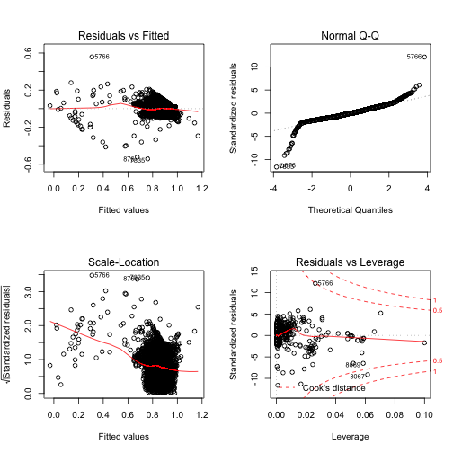
## 图像解释
残差和拟合值(左上)，残差和拟合值之间数据点大部分均匀分布在y=0.05两侧，红色线呈现出平稳状态，说明原数据集存在部分异常点如第7835行数据。

残差QQ图(右上)，正态性一般，离群点较多，详见放大图。

标准化残差平方根和拟合值(左下)，数据点分布在y>0正侧，呈现出聚合的分布，红色线呈现出一条平稳下降的曲线并没有明显的形状特征。

标准化残差和杠杆值(右下)，出现红色等高线，
则说明数据中有特别影响回归结果的异常点。


## 全局验证

```r
library(gvlma)
data.gvmodel <- gvlma(data.lm7)
summary(data.gvmodel)
```

```
## 
## Call:
## lm(formula = y ~ x1 + x2 + x4 + I(x2^2) + x4:x3 + x1:x3 + x2:x5, 
##     data = data)
## 
## Residuals:
##      Min       1Q   Median       3Q      Max 
## -0.54138 -0.03165 -0.00024  0.02747  0.55767 
## 
## Coefficients:
##             Estimate Std. Error t value Pr(>|t|)    
## (Intercept)  0.61234    0.01077  56.877   <2e-16 ***
## x1           0.03493    0.02316   1.509    0.131    
## x2           0.42506    0.03522  12.070   <2e-16 ***
## x4          -0.20089    0.01807 -11.117   <2e-16 ***
## I(x2^2)      0.85599    0.03556  24.070   <2e-16 ***
## x4:x3        0.91158    0.01580  57.678   <2e-16 ***
## x1:x3       -1.63550    0.03613 -45.262   <2e-16 ***
## x2:x5       -0.49226    0.02435 -20.215   <2e-16 ***
## ---
## Signif. codes:  0 '***' 0.001 '**' 0.01 '*' 0.05 '.' 0.1 ' ' 1
## 
## Residual standard error: 0.04663 on 8262 degrees of freedom
## Multiple R-squared:  0.6847,	Adjusted R-squared:  0.6844 
## F-statistic:  2563 on 7 and 8262 DF,  p-value: < 2.2e-16
## 
## 
## ASSESSMENT OF THE LINEAR MODEL ASSUMPTIONS
## USING THE GLOBAL TEST ON 4 DEGREES-OF-FREEDOM:
## Level of Significance =  0.05 
## 
## Call:
##  gvlma(x = data.lm7) 
## 
##                        Value  p-value                   Decision
## Global Stat        41844.612 0.000000 Assumptions NOT satisfied!
## Skewness              96.097 0.000000 Assumptions NOT satisfied!
## Kurtosis           41464.361 0.000000 Assumptions NOT satisfied!
## Link Function          8.616 0.003332 Assumptions NOT satisfied!
## Heteroscedasticity   275.537 0.000000 Assumptions NOT satisfied!
```
结果不理想

## 正态性与异常值

```r
qqPlot(data.lm7,labels = row.names(data),id.method = "identify",
       simulate = TRUE,main = "Q-Q Plot")
```

```
## Error in as.data.frame.default(data, optional = TRUE): cannot coerce class '"function"' to a data.frame
```

```r
#正态性一般，离群点较多
```
## 去除异常值

```r
outlierTest(data.lm7)
```

```
##        rstudent unadjusted p-value Bonferroni p
## 5766  12.229110         4.2796e-34   3.5392e-30
## 7835 -11.711665         1.9668e-31   1.6265e-27
## 876  -11.410507         6.2048e-30   5.1314e-26
## 8067  -9.185330         5.1072e-20   4.2237e-16
## 2202  -8.737101         2.8629e-18   2.3676e-14
## 8270  -8.608109         8.8006e-18   7.2781e-14
## 7462  -7.835961         5.2313e-15   4.3263e-11
## 7461  -7.768540         8.8921e-15   7.3538e-11
## 6845  -7.216391         5.8112e-13   4.8059e-09
## 7463  -6.789574         1.2024e-11   9.9437e-08
```

```r
outlier <- c(5766,7835,876,8067,2202,8270,7462,7461,6845,7463)
data_new <- data[-outlier,]
head(data_new)
```

```
##             y        x1        x2        x3        x4        x5         x6
## 1 0.003521127 0.6782609 0.3636364 0.6040034 0.2242991 0.4772727 0.06617908
## 2 0.021126761 0.7130435 0.4181818 0.6187970 0.2336449 0.6363636 0.55747541
## 3 0.126760563 0.7304348 0.4363636 0.5095362 0.2710280 0.7159091 0.95764558
## 4 0.454225352 0.6869565 0.4545455 0.5977728 0.4299065 0.7500000 0.25883480
## 5 0.728873239 0.5478261 0.4545455 0.5553429 0.6915888 0.7727273 0.88862369
## 6 0.890845070 0.4173913 0.4727273 0.5405493 0.8411215 0.7727273 0.21335633
```

## 优化模型7

```r
data.lm8 <- lm(y ~ x1 + x2 + x4 + I(x2^2) + x4:x3 + x1:x3 + x2:x5, data_new)
summary(data.lm8)
```

```
## 
## Call:
## lm(formula = y ~ x1 + x2 + x4 + I(x2^2) + x4:x3 + x1:x3 + x2:x5, 
##     data = data_new)
## 
## Residuals:
##      Min       1Q   Median       3Q      Max 
## -0.34646 -0.03157 -0.00063  0.02720  0.26446 
## 
## Coefficients:
##             Estimate Std. Error t value Pr(>|t|)    
## (Intercept)  0.65901    0.01035  63.673  < 2e-16 ***
## x1           0.05844    0.02206   2.649  0.00809 ** 
## x2           0.25473    0.03406   7.478  8.3e-14 ***
## x4          -0.23903    0.01722 -13.879  < 2e-16 ***
## I(x2^2)      0.99553    0.03432  29.009  < 2e-16 ***
## x4:x3        0.90511    0.01502  60.274  < 2e-16 ***
## x1:x3       -1.65668    0.03434 -48.246  < 2e-16 ***
## x2:x5       -0.41276    0.02325 -17.750  < 2e-16 ***
## ---
## Signif. codes:  0 '***' 0.001 '**' 0.01 '*' 0.05 '.' 0.1 ' ' 1
## 
## Residual standard error: 0.04411 on 8252 degrees of freedom
## Multiple R-squared:  0.695,	Adjusted R-squared:  0.6947 
## F-statistic:  2686 on 7 and 8252 DF,  p-value: < 2.2e-16
```

## 重复查找异常值

```r
qqPlot(data.lm8,labels = row.names(data),id.method = "identify",
       simulate = TRUE,main = "Q-Q Plot")
```

```
## Error in is.data.frame(data): object 'data_new' not found
```

```r
outlierTest(data.lm8)
```

```
##       rstudent unadjusted p-value Bonferroni p
## 8069 -8.149550         4.1888e-16   3.4600e-12
## 8071 -7.463313         9.2961e-14   7.6786e-10
## 7838  6.083098         1.2313e-09   1.0171e-05
## 7839  6.036137         1.6466e-09   1.3601e-05
## 6846 -5.571848         2.5998e-08   2.1475e-04
## 1    -5.463513         4.8040e-08   3.9681e-04
## 7464 -5.178969         2.2839e-07   1.8865e-03
## 8070 -5.177935         2.2965e-07   1.8969e-03
## 8221  5.062682         4.2234e-07   3.4885e-03
## 1870 -5.061723         4.2446e-07   3.5060e-03
```

## 优化模型8

```r
outlier <- c(8069,8071,7838,7839,6846,1,7464,8070,8221,1870)
data_new1 <- data_new[-outlier,]
data.lm9 <- lm(y ~ x1 + x2 + x4 + I(x2^2) + x4:x3 + x1:x3 + x2:x5,
               data_new1)
summary(data.lm9)
```

```
## 
## Call:
## lm(formula = y ~ x1 + x2 + x4 + I(x2^2) + x4:x3 + x1:x3 + x2:x5, 
##     data = data_new1)
## 
## Residuals:
##      Min       1Q   Median       3Q      Max 
## -0.34990 -0.03155 -0.00063  0.02715  0.26007 
## 
## Coefficients:
##             Estimate Std. Error t value Pr(>|t|)    
## (Intercept)  0.66064    0.01035  63.824  < 2e-16 ***
## x1           0.06384    0.02201   2.901  0.00373 ** 
## x2           0.25512    0.03398   7.508 6.65e-14 ***
## x4          -0.24347    0.01720 -14.153  < 2e-16 ***
## I(x2^2)      0.98136    0.03427  28.634  < 2e-16 ***
## x4:x3        0.89980    0.01498  60.079  < 2e-16 ***
## x1:x3       -1.64745    0.03434 -47.971  < 2e-16 ***
## x2:x5       -0.40060    0.02326 -17.225  < 2e-16 ***
## ---
## Signif. codes:  0 '***' 0.001 '**' 0.01 '*' 0.05 '.' 0.1 ' ' 1
## 
## Residual standard error: 0.0439 on 8242 degrees of freedom
## Multiple R-squared:  0.6892,	Adjusted R-squared:  0.689 
## F-statistic:  2611 on 7 and 8242 DF,  p-value: < 2.2e-16
```
## 结论2:模型评价
模型9比模型8的R方下降，所以用 data.lm8：
T检验：除了x1, 所有自变量都是非常显著***
F检验：同样是非常显著，p-value < 2.2e-16
调整后的R^2：相关性为0.689 


## 分析方差相同假设

```r
ncvTest(data.lm8)
```

```
## Non-constant Variance Score Test 
## Variance formula: ~ fitted.values 
## Chisquare = 1329.946, Df = 1, p = < 2.22e-16
```

```r
#p值小于0.05，不满足方差相同的假设
```
## 分析误差相互独立假设

```r
durbinWatsonTest(data.lm8)
```

```
##  lag Autocorrelation D-W Statistic p-value
##    1       0.7380317     0.5186318       0
##  Alternative hypothesis: rho != 0
```

```r
#p值小于0.05，误差之间并不是相互独立
```
## 是否存在多重共线

```r
vif(data.lm8)
```

```
##        x1        x2        x4   I(x2^2)     x4:x3     x1:x3     x2:x5 
##  6.335355 40.601347 13.885134 29.530156  6.172482  9.159339 21.261705
```

```r
#所有自变量VIF都比较大，可认为存在多重共线性的问题
```

## 结论3:
综上所述，大概率需引入降维

# **降维**

## 导入包

```r
library(dplyr)
library(sqldf)
library(class)
# 为数据集增加序号列
data$id <- c(1:nrow(data))
```

## 划分训练集与测试集

```r
# 将data集中70%的数据划分为训练集
data_train <- sample_frac(data, 0.7, replace = TRUE)

# 使用sql语句将剩下的30%花费为测试集
data_test <- sqldf("
               select *
               from data
               where id not in (
               select id
               from data_train
               )
               ")
```


```r
# 去除序号列（id）
data <- data[,-8]
data_train <- data_train[,-8]
data_test <- data_test[,-8]
```

## 碎石图与主成分分析

```r
#对x列主成分分析
data_train_pca <- princomp(data_train[,2:7])
screeplot(data_train_pca, npcs = ncol(data_train),type="lines")
```

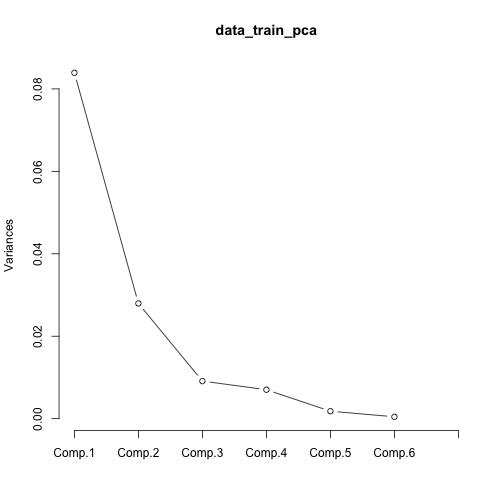

```r
summary(data_train_pca)
```

```
## Importance of components:
##                           Comp.1    Comp.2     Comp.3     Comp.4     Comp.5      Comp.6
## Standard deviation     0.2896718 0.1671902 0.09547207 0.08379711 0.04258943 0.021282712
## Proportion of Variance 0.6441416 0.2145807 0.06997154 0.05390473 0.01392427 0.003477144
## Cumulative Proportion  0.6441416 0.8587223 0.92869385 0.98259858 0.99652286 1.000000000
```
第一行是特征值，越大，它所对应的主成分变量包含的信息就越多

由上图可见四项指标做分析后，给出了6个成分，他们的重要性分别为：0.6259068， 0.2227313， 0.07545228，0.05733950， 0.01429945， 0.004270653，
累积贡献为：0.6259068， 0.8486381， 0.92409039，0.98142989， 0.99572935， 1.000000000

各个成分的碎石图也如上，可见成份1到成份4的累积贡献已经达到98%，因此采用这4个成份便可充分解释y的基本信息


```r
data_train_pca$loadings
```

```
## 
## Loadings:
##    Comp.1 Comp.2 Comp.3 Comp.4 Comp.5 Comp.6
## x1                0.420  0.280  0.787  0.355
## x2         0.238  0.728  0.414 -0.449 -0.199
## x3                0.500 -0.864              
## x4         0.607 -0.139        -0.257  0.738
## x5         0.756 -0.158         0.334 -0.537
## x6 -1.000                                   
## 
##                Comp.1 Comp.2 Comp.3 Comp.4 Comp.5 Comp.6
## SS loadings     1.000  1.000  1.000  1.000  1.000  1.000
## Proportion Var  0.167  0.167  0.167  0.167  0.167  0.167
## Cumulative Var  0.167  0.333  0.500  0.667  0.833  1.000
```

```r
#loadings显示的是载荷的内容，这个值实际上是主成分对于原始变量x的系数。
# Comp.1 = -1*x6
# Comp.2 = 0.230 * x2 + 0.600 * x4 + 0.762 * x5
# Comp.3 = 0.387 * x1 + 0.688 * x2 + 0.573 * x3 - 0.135 * x4 - 0.171 * x5 + 0 * x6
# Comp.4 = 0.278 * x1 + 0.503 * x2 - 0.816 * x3 +0 * x4 + 0 * x5 + 0 * x6
```


```r
new_test <- as.matrix(data_test[,2:7])%*%as.matrix(data_train_pca$loadings[,1:4])
# 转化为数据框
new_test <- as.data.frame(new_test)
head(new_test,10)
```

```
##         Comp.1    Comp.2    Comp.3     Comp.4
## 1  -0.57162667 0.7539972 0.7782348 -0.1988754
## 2  -0.27607684 0.9709147 0.7389678 -0.1864856
## 3  -0.23464792 1.2366328 0.5498273 -0.2183351
## 4  -0.16039856 1.1311179 0.4549367 -0.2853591
## 5  -0.50018935 1.1167851 0.4478388 -0.3094952
## 6  -0.23514658 1.1231580 0.4989976 -0.4690972
## 7  -0.07076678 1.1078270 0.4399219 -0.3937769
## 8  -0.13426379 1.1102014 0.4407353 -0.3734537
## 9  -0.64681255 1.0958548 0.5182376 -0.5008996
## 10 -0.24815513 1.0973913 0.4444398 -0.4468604
```


```r
data_temp<-predict(data_train_pca) 
plot(data_temp[,1:2])
```

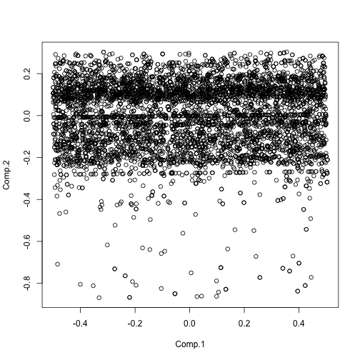

